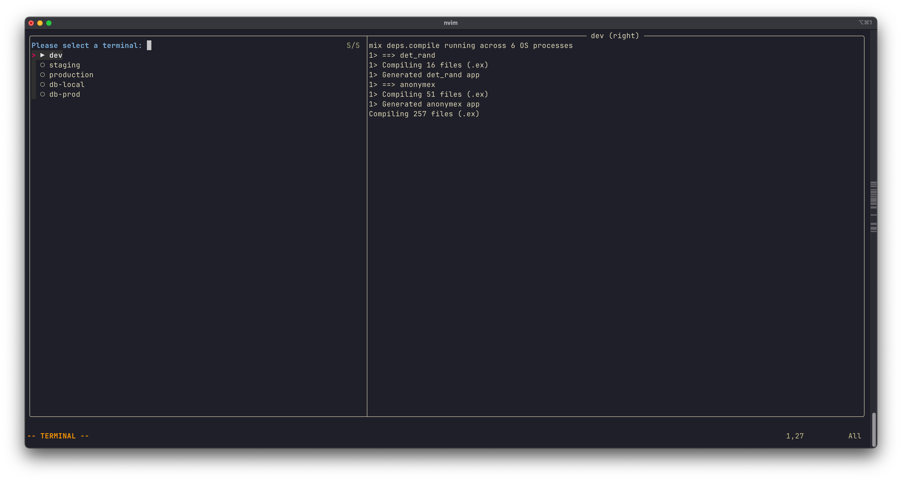

# Development Environment

This guide demonstrates how to create a comprehensive development environment with ergoterm using project-specific configuration files.

## Project-Specific Configuration with `.nvim.lua`

Neovim automatically loads `.nvim.lua` files from your project root, making them perfect for project-specific terminal setups. This keeps your development environments isolated and immediately available when you open a project.

**Security note:** Since `.nvim.lua` executes arbitrary Lua code, only load files from projects you trust. Neovim will prompt you to confirm before loading these files for the first time.

## Example: Phoenix Framework (Elixir)

Here's a complete development environment setup for a Phoenix application with separate terminals for different environments and databases:

**.nvim.lua** (in your project root):

```lua
local ergoterm = require("ergoterm")

-- Development server (Phoenix)
local dev_server = ergoterm:new({
  name = "dev",
  cmd = "mix phx.server",
  layout = "right",
  size = {
    right = "40%"
  },
  sticky = true
})

-- Staging console (connected to Fly.io)
local staging_console = ergoterm:new({
  name = "staging",
  cmd = "fly ssh console --app myapp-staging --command '/app/bin/myapp remote'",
  layout = "right",
  size = {
    right = "40%"
  },
  sticky = true
})

-- Production console (connected to Fly.io)
local production_console = ergoterm:new({
  name = "production",
  cmd = "fly ssh console --app myapp-production --command '/app/bin/myapp remote'",
  layout = "right",
  size = {
    right = "40%"
  },
  sticky = true
})

-- Local database (psql)
local local_db = ergoterm:new({
  name = "db-local",
  cmd = "psql -U postgres -d myapp_dev",
  layout = "below",
  size = {
    below = "30%"
  },
  sticky = true
})

-- Production database (psql via Fly.io proxy)
local prod_db = ergoterm:new({
  name = "db-prod",
  cmd = "fly proxy 5432 --app myapp-db && psql postgres://localhost:5432/myapp",
  layout = "below",
  size = {
    below = "30%"
  },
  sticky = true
})
```

**Configuration explained:**

- **Server terminal** (`dev_server`): Runs `mix phx.server` on the right side for local development
- **Staging/Production consoles**: Remote IEx sessions connected to deployed environments via Fly.io SSH
- **Database terminals**: Local psql access for development, proxied connection for production database
- **Sticky terminals**: `sticky = true` keeps terminals available for restart even after the process exits



### Usage

Once your `.nvim.lua` is loaded, all terminals are registered and ready to use. Simply run:

```vim
:TermSelect
```

This opens the terminal picker showing all five terminals. Select any terminal to start it and open it in the configured layout.
