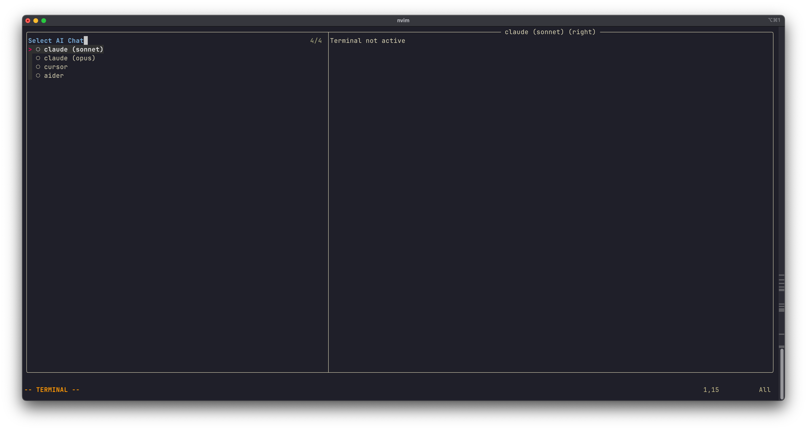

# Interactive AI Assistants

This guide shows how to integrate AI chat tools (like Claude CLI, Cursor, Aider) into your Neovim workflow using ergoterm.

## Simple Setup: Single AI Assistant

Here's a basic configuration for the Claude CLI:

```lua
local ergoterm = require("ergoterm")

local claude = ergoterm:new({
  cmd = "claude",
  name = "claude",
  layout = "right",
  auto_list = false,
  bang_target = false
  sticky = true,
  watch_files = true,
})
```

**Configuration explained:**
- `layout = "right"` - Opens as a vertical split on the right side
- `auto_list = false` - Hides from the default picker (we'll use custom selectors)
- `bang_target = false` - Excludes from bang (`!`) (again, we'll manage manually)
- `sticky = true` - Keeps terminal always ready to be restarted if closed
- `watch_files = true` - Refreshes buffer when output is received after Claude edits files

### Basic Keybindings

```lua
local map = vim.keymap.set
local opts = { noremap = true, silent = true }

-- Toggle Claude terminal
map("n", "<leader>ai", function()
  claude:toggle()
end, { desc = "Toggle Claude" })

-- Reference current file to Claude
map("n", "<leader>aa", function()
  local file = vim.fn.expand("%:p")
  claude:send({ "@" .. file .. " " }, { new_line = false })
end, opts)

-- Send current line to Claude
map("n", "<leader>as", function()
  claude:send("single_line")
end, opts)

-- Send visual selection to Claude
map("v", "<leader>as", function()
  claude:send("visual_selection", { trim = false })
end, opts)
```


## Multiple AI Assistants

To work with multiple AI chatbots, you can create a factory with shared defaults:

```lua
local ai_chats = ergoterm.with_defaults({
  layout = "right",
  auto_list = false,
  bang_target = false
  sticky = true,
  watch_files = true,
  tags = { "ai_chat" }
})

-- Create instances for different AI tools
local claude_sonnet = ai_chats:new({
  cmd = "claude --model sonnet",
  name = "claude (sonnet)"
})

local claude_opus = ai_chats:new({
  cmd = "claude --model opus",
  name = "claude (opus)"
})

local cursor = ai_chats:new({
  cmd = "cursor-agent",
  name = "cursor"
})

local aider = ai_chats:new({
  cmd = "aider",
  name = "aider"
})
```

- We use the `tags` option to label these terminals as `ai_chat` for easy filtering later.

### Custom Selection

Use tags to create a custom picker for AI chatbots:

```lua
local chats = ergoterm.filter_by_tag("ai_chat")

vim.keymap.set("n", "<leader>al", function()
  ergoterm.select({
    terminals = chats,
    prompt = "Select AI Chat to Open"
  })
end, { desc = "List AI Chats" })
```



### Progressive Disclosure with Smart Selection

Use `select_started` to create intelligent keybindings that adapt to context:

```lua
-- Send line: shortcuts to Claude Sonnet if it's the only one running,
-- otherwise shows picker
vim.keymap.set("n", "<leader>as", function()
  ergoterm.select_started({
    terminals = chats,
    prompt = "Send to chat",
    callbacks = function(term)
      return term:send("single_line")
    end,
    default = claude_sonnet
  })
end, { noremap = true, silent = true, desc = "Send Line to AI Chat" })

-- Send selection: same smart behavior for visual mode
vim.keymap.set("v", "<leader>as", function()
  ergoterm.select_started({
    terminals = chats,
    prompt = "Send to chat",
    callbacks = function(term)
      return term:send("visual_selection", { trim = false })
    end,
    default = claude_sonnet
  })
end, { noremap = true, silent = true, desc = "Send Selection to AI Chat" })
```

**How it works:**
- If **no chats are running**, uses the `default`, in this case Claude Sonnet (no picker shown)
- If **one chat is running**, sends directly to it (no picker shown)
- If **multiple chats are running**, shows picker to choose which one

This creates a smooth workflow that adapts to your current context.

## Polymorphic Behavior with Meta

Different AI tools use different commands for common operations. Use `meta` to handle these differences:

```lua
local claude_sonnet = ai_chats:new({
  cmd = "claude --model sonnet",
  name = "claude (sonnet)",
  meta = {
    add_file = function(file) return "@" .. file end
  }
})

local claude_opus = ai_chats:new({
  cmd = "claude --model opus",
  name = "claude (opus)",
  meta = {
    add_file = function(file) return "@" .. file end
  }
})

local cursor = ai_chats:new({
  cmd = "cursor-agent",
  name = "cursor",
  meta = {
    add_file = function(file) return "@" .. file end
  }
})

local aider = ai_chats:new({
  cmd = "aider",
  name = "aider",
  meta = {
    add_file = function(file) return "/add " .. file end
  }
})
```

Now create a single mapping that works with all chatbots:

```lua
vim.keymap.set("n", "<leader>aa", function()
  local file = vim.fn.expand("%:p")

  ergoterm.select_started({
    terminals = chats,
    prompt = "Add file to chat",
    callbacks = function(term)
      return term:send({ term.meta.add_file(file) }, { new_line = false })
    end,
    default = claude_sonnet
  })
end, { noremap = true, silent = true, desc = "Add File to AI Chat" })
```

This single keybinding adapts to whichever AI chatbot you're using, automatically using the correct command syntax for each tool.

## Complete Example Configuration

```lua
local ergoterm = require("ergoterm")

-- Create factory with shared defaults
local ai_chats = ergoterm.with_defaults({
  layout = "right",
  tags = { "ai_chat" },
  auto_list = false,
  bang_target = false,
  sticky = true,
  watch_files = true
})

-- Create chatbot instances
local claude_sonnet = ai_chats:new({
  cmd = "claude --model sonnet",
  name = "claude (sonnet)",
  meta = {
    add_file = function(file) return "@" .. file end
  }
})

local claude_opus = ai_chats:new({
  cmd = "claude --model opus",
  name = "claude (opus)",
  meta = {
    add_file = function(file) return "@" .. file end
  }
})

local cursor = ai_chats:new({
  cmd = "cursor-agent",
  name = "cursor",
  meta = {
    add_file = function(file) return "@" .. file end
  }
})

local aider = ai_chats:new({
  cmd = "aider",
  name = "aider",
  meta = {
    add_file = function(file) return "/add " .. file end
  }
})

-- Keybindings
local map = vim.keymap.set
local opts = { noremap = true, silent = true }
local chats = ergoterm.filter_by_tag("ai_chat")

-- Toggle your default chatbot
map("n", "<leader>ai", function() claude_sonnet:toggle() end, { desc = "Toggle Claude (Sonnet)" })

-- List all AI chats
map("n", "<leader>al", function()
  ergoterm.select({
    terminals = chats,
    prompt = "Select AI Chat"
  })
end, { desc = "List AI Chats" })

-- Smart send line (adapts to running chats)
map("n", "<leader>as", function()
  ergoterm.select_started({
    terminals = chats,
    prompt = "Send to chat",
    callbacks = function(term)
      return term:send("single_line")
    end,
    default = claude_sonnet
  })
end, opts)

-- Smart send selection
map("v", "<leader>as", function()
  ergoterm.select_started({
    terminals = chats,
    prompt = "Send to chat",
    callbacks = function(term)
      return term:send("visual_selection", { trim = false })
    end,
    default = claude_sonnet
  })
end, opts)

-- Smart add file (uses correct syntax per chatbot)
map("n", "<leader>aa", function()
  local file = vim.fn.expand("%:p")
  ergoterm.select_started({
    terminals = chats,
    prompt = "Add file to chat",
    callbacks = function(term)
      return term:send({ term.meta.add_file(file) }, { new_line = false })
    end,
    default = claude_sonnet
  })
end, opts)
```
