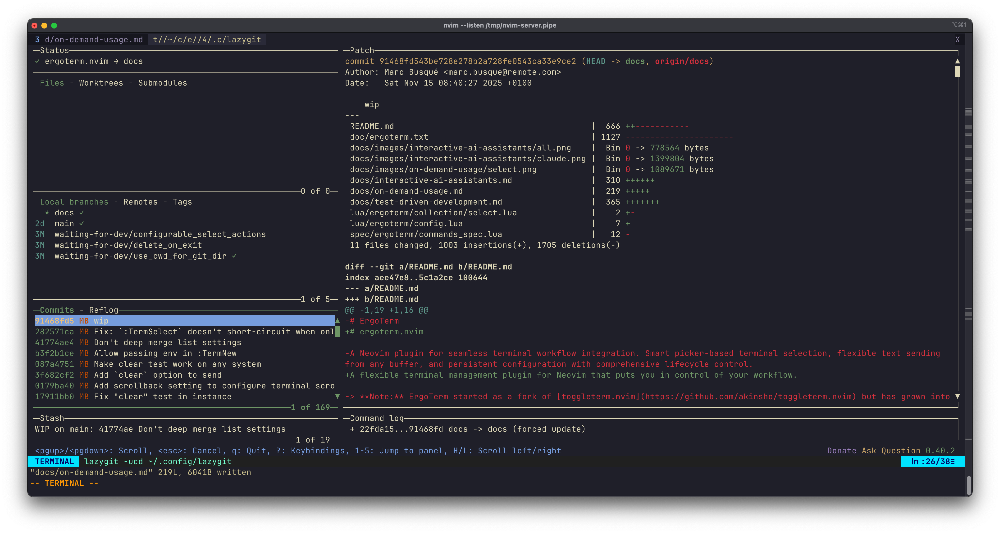

# On-Demand Terminal Access

This guide covers using ergoterm for quick, ad-hoc terminal operations through Vim commands.

## Terminal Selection Pattern

Most commands support three ways to select which terminal to operate on:

1. **Bang (`!`)**: Use the last focused terminal
   ```vim
   :TermSelect!
   :TermSend!
   :TermUpdate!
   ```
   **Note:** Terminals can be excluded from bang targeting by setting `bang_target = false`

2. **Target by name**: Specify terminal by name
   ```vim
   :TermSelect target=myterminal
   :TermSend target=tests
   :TermUpdate target=dev
   ```

3. **Picker**: Open selection UI (default when no bang or target)
   ```vim
   :TermSelect
   :TermSend
   :TermUpdate
   ```
   **Note:** If only one terminal is available, the picker is skipped and that terminal is selected automatically besides `:TermSelect`, which always opens the picker if no bang or target is provided.

## `:TermNew` - Create Terminal

Create and focus a new terminal with optional configuration.

```vim
:TermNew [option=value ...]
```

All options from [Terminal Defaults](../README.md#terminal-defaults) are supported except callbacks (`on_*` functions). Additionally:

- `cmd` - Command to run (default: shell)
- `dir` - Working directory (default: current directory). Special value: `git_dir` expands to git root
- `name` - Terminal name (default: command name)

**Syntax for complex types:**
- **Table settings**: Use dot notation: `size.right="30%"`
- **List settings**: Use comma-separated values: `tags=git,dev`

### Examples

```vim
" Create terminal with default settings
:TermNew

" Create terminal running lazygit in floating layout
:TermNew cmd=lazygit layout=float name=git

" Create terminal running claude on the right side, watching file changes
:TermNew cmd=claude watch_files=true layout=right

" Create small terminal below for running tests
:TermNew cmd="rspec --watch" size.below="30%" auto_scroll=true name=tests
```

## `:TermSelect` - Select Terminal

Open terminal picker or focus a specific terminal if `!` or `target` is provided.

```vim
:TermSelect[!] [target=name]
```

### Examples

```vim
" Open terminal picker
:TermSelect

" Focus last focused terminal
:TermSelect!

" Focus terminal by name
:TermSelect target=tests
```



## `:TermUpdate` - Update Terminal

Update terminal settings after creation.

```vim
:TermUpdate[!] option=value [option=value ...]
```

All options from `:TermNew` can be updated **except**:
- `cmd`
- `dir`
- `scrollback`
- `env`

**Syntax for complex types:**
- **Table settings**: Use dot notation: `size.right="30%"` (values are deep-merged)
- **List settings**: Use comma-separated values: `tags=git,dev` (values are replaced)

### Examples

```vim
" Change layout of last focused terminal. Needs to be reopened after.
:TermUpdate! layout=float

" Update specific terminal by name
:TermUpdate target=server cleanup_on_success=false

" Change multiple settings
:TermUpdate! layout=right size.right="40%" persist_mode=true
```

## `:TermSend` - Send Text to Terminal

Send text from buffer to terminal.

```vim
:TermSend[!] [option=value ...]
:[range]TermSend[!] [option=value ...]
```

Without a range, sends the current line. With a range (visual selection), sends selected text.

### Options

| Option | Type | Default | Description |
|--------|------|---------|-------------|
| `action` | `string` | `"focus"` | Terminal action: `"focus"` (open and focus), `"open"` (open without focus), `"start"` (send in the background) |
| `clear` | `boolean` | `false` | Clear terminal before sending text |
| `decorator` | `string` | `nil` | Text decorator to apply (e.g., `"markdown_code"`, `"identity"`) |
| `new_line` | `boolean` | `true` | Append newline to execute command |
| `text` | `string` | Current line/selection | Explicit text to send (overrides line/selection) |
| `trim` | `boolean` | `true` | Trim leading/trailing whitespace |

**Text decorators** transform text before sending. Built-in decorators: `identity` (no transformation), `markdown_code` (wraps in markdown code block). Custom decorators can be configured in [Text Decorators](../README.md#text-decorators).

### Examples

```vim
" Send current line to last focused terminal
:TermSend!

" Send visual selection
:'<,'>TermSend!

" Send without executing (no newline)
:TermSend! new_line=false

" Send and show output without focusing terminal
:TermSend! action=open

" Send explicit text to specific terminal
:TermSend text="npm test" target=tests

" Send as markdown code block
:'<,'>TermSend! decorator=markdown_code action=open

" Clear terminal before sending
:TermSend! clear=true text="npm run build"
```

## `:TermInspect` - Inspect Terminal

Display terminal internal state for debugging.

```vim
:TermInspect[!] [target=name]
```

### Examples

```vim
" Inspect last focused terminal
:TermInspect!

" Inspect specific terminal
:TermInspect target=tests
```

## `:TermToggleUniversalSelection` - Toggle Universal Selection

Enable/disable universal selection mode, which makes all terminals visible from `:TermSelect` picker and a target for bang commands.

```vim
:TermToggleUniversalSelection
```

## Recommended Keybindings

Get started with these basic keybindings:

```lua
local map = vim.keymap.set
local opts = { noremap = true, silent = true }

-- Terminal creation with different layouts
map("n", "<leader>cs", ":TermNew layout=below<CR>", opts)
map("n", "<leader>cv", ":TermNew layout=right<CR>", opts)
map("n", "<leader>cf", ":TermNew layout=float<CR>", opts)
map("n", "<leader>ct", ":TermNew layout=tab<CR>", opts)

-- Open terminal picker
map("n", "<leader>cl", ":TermSelect<CR>", opts)

-- Send text to last focused terminal
map("n", "<leader>cs", ":TermSend! new_line=false<CR>", opts)
map("x", "<leader>cs", ":TermSend! new_line=false<CR>", opts)

-- Send and show output without focusing terminal
map("n", "<leader>cx", ":TermSend! action=open<CR>", opts)
map("x", "<leader>cx", ":TermSend! action=open<CR>", opts)
```
