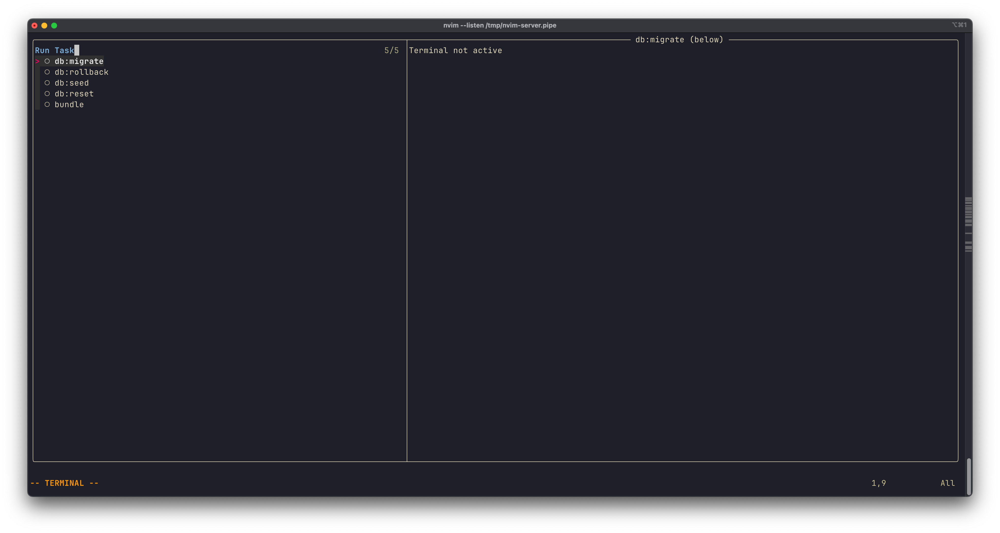

# Task Runner

This guide shows how to create quick access to common project tasks using project-specific configuration files.

## Project-Specific Task Configuration with `.nvim.lua`

Every project has repetitive tasks: running migrations, seeding databases, compiling assets, updating dependencies, or viewing routes. Using `.nvim.lua` files, you can define these tasks once and access them instantly with a simple keybinding.

**Security note:** Since `.nvim.lua` executes arbitrary Lua code, only load files from projects you trust. Neovim will prompt you to confirm before loading these files for the first time.

## Example: Rails Project Tasks

Here's a complete task runner setup for a Rails project:

**.nvim.lua** (in your project root):

```lua
local ergoterm = require("ergoterm")

-- Create factory with shared defaults for tasks
local tasks = ergoterm.with_defaults({
  layout = "below",
  size = {
    below = "30%"
  },
  tags = { "task" },
  auto_list = false,
  bang_target = false,
  sticky = true,
  auto_scroll = true,
  default_action = function(term) term:open() end
})
```

**Configuration explained:**
- `layout = "below"` - Opens as a horizontal split below the current window
- `size = { below = "30%" }` - Uses 30% of the screen height
- `tags = { "task" }` - Labels terminals for filtering in custom pickers
- `auto_list = false` - Hides from default picker (we'll use a custom selector)
- `bang_target = false` - Excludes from bang commands
- `sticky = true` - Keeps terminals ready for restart even after completion
- `auto_scroll = true` - Automatically scrolls to latest output
- `default_action = function(term) term:open() end` - Makes terminals open (keeping focus on your current window) when selected

### Define Common Tasks

Create terminals for frequent operations:

```lua
local db_migrate = tasks:new({
  name = "db:migrate",
  cmd = "rails db:migrate"
})

local db_rollback = tasks:new({
  name = "db:rollback",
  cmd = "rails db:rollback"
})

local db_seed = tasks:new({
  name = "db:seed",
  cmd = "rails db:seed"
})

local db_reset = tasks:new({
  name = "db:reset",
  cmd = "rails db:reset"
})

local bundle_install = tasks:new({
  name = "bundle",
  cmd = "bundle install"
})
```

### Task Selection Keybinding

Create a single keybinding to select from all available tasks:

```lua
local task_list = ergoterm.filter_by_tag("task")

vim.keymap.set("n", ",t", function()
  ergoterm.select({
    terminals = task_list,
    prompt = "Run Task"
  })
end, { noremap = true, silent = true, desc = "Run Task" })
```

**How it works:**
- Press `,t` to open a picker showing all defined tasks
- Select a task to run it in a split below your editor
- The terminal opens automatically and shows the command output
- Use `,t` again to run another task or re-run the same one


