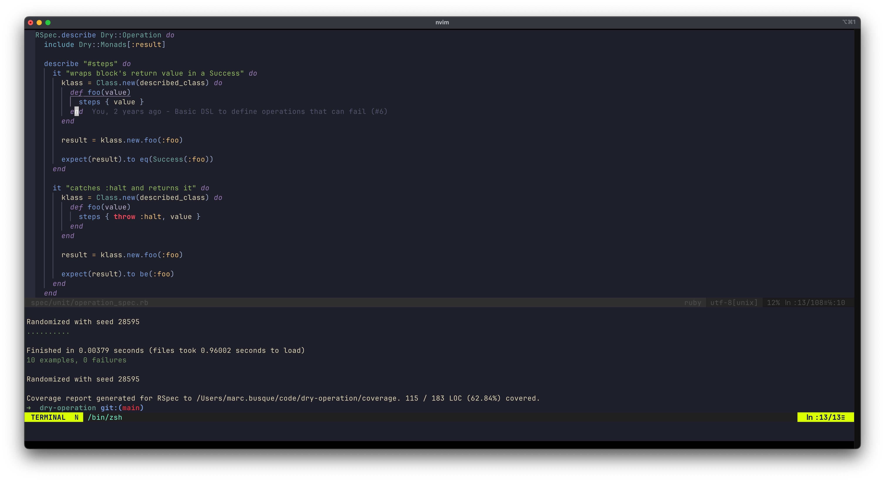

# Test Runner

This guide shows how to integrate test runners into your Neovim workflow using ergoterm.

## Simple Example: Ruby's RSpec

Here's a basic configuration for RSpec:

```lua
local ergoterm = require("ergoterm")

local rspec = ergoterm:new({
  auto_list = false,
  bang_target = false,
  sticky = true,
  layout = "below",
  size = {
    below = "20%"
  },
  auto_scroll = true
})
```

**Configuration explained:**
- `layout = "below"` - Opens as a horizontal split below the current window
- `size = { below = "20%" }` - Uses 20% of the screen height
- `auto_list = false` - Hides from the default picker
- `bang_target = false` - Excludes from bang commands (`!`) (we'll manage manually)
- `sticky = true` - Keeps terminal always ready to be restarted if closed
- `auto_scroll = true` - Automatically scrolls to the latest output as tests run



### Basic Keybindings

```lua
local map = vim.keymap.set
local opts = { noremap = true, silent = true }

-- Test single test at cursor
map("n", "<leader>tt", function()
  rspec:send({ 'bundle exec rspec ' .. vim.fn.expand("%") .. ':' .. vim.fn.line(".") }, { action = "open" })
end, { desc = "Test single test" })

-- Test current file
map("n", "<leader>tf", function()
  rspec:send({ 'bundle exec rspec ' .. vim.fn.expand("%") }, { action = "open" })
end, { desc = "Test current file" })

-- Test all files
map("n", "<leader>ta", function()
  rspec:send({ 'bundle exec rspec' }, { action = "open" })
end, { desc = "Test all files" })
```

**How it works:**
- `action = "open"` ensures the test terminal opens and becomes visible when running tests
  - Other `action` options: `"focus"` (default, focuses terminal if already open), `"start"` (starts terminal if not running but doesn't bring it to front)
- `vim.fn.expand("%")` gets the current file path
- `vim.fn.line(".")` gets the current cursor line number for pinpoint test execution

### Re-running Tests

The `send("last")` command re-runs the last command sent to the terminal:

```lua
map("n", "<leader>tl", function()
  rspec:send("last", { action = "open" })
end, { desc = "Re-run last test" })
```

This is useful for quickly re-running the same test after making changes, without having to move your cursor back to the test location.

## Multiple Test Runners

To work with multiple test frameworks, you can create a factory with shared defaults and use `meta` to define test commands:

```lua
local ergoterm = require("ergoterm")

local test_runners = ergoterm.with_defaults({
  layout = "below",
  size = {
    below = "20%"
  },
  auto_list = false,
  bang_target = false,
  sticky = true,
  auto_scroll = true
})

local rspec = test_runners:new({
  name = "rspec",
  meta = {
    current_line = function()
      return "bundle exec rspec " .. vim.fn.expand("%") .. ':' .. vim.fn.line(".")
    end,
    current_file = function()
      return "bundle exec rspec " .. vim.fn.expand("%")
    end,
    current_directory = function()
      return "bundle exec rspec " .. vim.fn.expand("%:h")
    end,
    all = "bundle exec rspec"
  }
})

local pytest = test_runners:new({
  name = "pytest",
  meta = {
    current_line = function()
      return "pytest " .. vim.fn.expand("%") .. '::' .. vim.fn.line(".")
    end,
    current_file = function()
      return "pytest " .. vim.fn.expand("%")
    end,
    current_directory = function()
      return "pytest " .. vim.fn.expand("%:h")
    end,
    all = "pytest"
  }
})
```

Now create keybindings that automatically select the right test runner based on filetype:

```lua
local map = vim.keymap.set

local function get_test_runner()
  local ft = vim.bo.filetype
  if ft == "ruby" then
    return rspec
  elseif ft == "python" then
    return pytest
  end
  return nil
end

-- Test single test at cursor
map("n", "<leader>tt", function()
  local runner = get_test_runner()
  if runner then
    runner:send({ runner.meta.current_line() }, { action = "open" })
  end
end, { noremap = true, silent = true, desc = "Test single test" })

-- Test current file
map("n", "<leader>tf", function()
  local runner = get_test_runner()
  if runner then
    runner:send({ runner.meta.current_file() }, { action = "open" })
  end
end, { noremap = true, silent = true, desc = "Test current file" })

-- Test current directory
map("n", "<leader>td", function()
  local runner = get_test_runner()
  if runner then
    runner:send({ runner.meta.current_directory() }, { action = "open" })
  end
end, { noremap = true, silent = true, desc = "Test current directory" })

-- Test all files
map("n", "<leader>ta", function()
  local runner = get_test_runner()
  if runner then
    runner:send({ runner.meta.all }, { action = "open" })
  end
end, { noremap = true, silent = true, desc = "Test all files" })

-- Re-run last test
map("n", "<leader>tl", function()
  local runner = get_test_runner()
  if runner then
    runner:send("last", { action = "open" })
  end
end, { noremap = true, silent = true, desc = "Re-run last test" })
```

**How it works:**
- Each `meta` field contains the complete command for that test scope
- The `get_test_runner()` function selects the appropriate runner based on the current buffer's filetype
- The same keybindings work across all test frameworks, automatically using the correct commands
